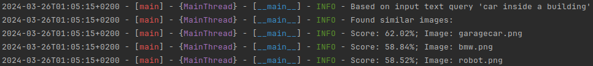

## find-Ilya

Using an image to find similar images.
More accurate description would be "image-to-image" search tool, but also a "text-to-image" search tool.

## Usage

```bash
usage: main.py [-h] [-v] COMMAND ...

Tool which finds images in the target folder, given text or an image as input.

options:
  -h, --help     show this help message and exit
  -v, --version  show program's version number and exit

Commands:
  COMMAND
    create_db    Create a new FAISS database
    search_db    Search a database for an image

You can also see help for the commands like 'main.py searchdb -h'
usage: main.py search_db [-h] -d DB_PATH (-i IMAGE_QUERY | -t TEXT_QUERY)

options:
  -h, --help            show this help message and exit
  -d DB_PATH, --db_path DB_PATH
                        Path to the FAISS database
  -i IMAGE_QUERY, --image_query IMAGE_QUERY
                        Path to the target image to search for images
  -t TEXT_QUERY, --text_query TEXT_QUERY
                        Text query to search for images

```


First you have to index a folder containing a set of images. This command will create a FAISS database in the target folder,
'examples/vector_database', will add entries in the database using the filename of each picture and also the corresponding embeddings:

```bash
poetry run main.py create_db -f examples/images -o examples/vector_database
```

Then you can search for similar images like this:
```bash
poetry run python main.py search_db -d examples/vector_database/ -i examples/target_image/Ilya.png
```

## Examples

Given the input image found in 'examples/target_image/Ilya.png'

#### Command:
```bash
poetry run python main.py search_db -d examples/vector_database/ -i examples/target_image/Ilya.png
```

#### Input image


#### Output


___
The images are found in 'examples/images':

Score: **90.14%** for 'examples/images/**Ilya s.png**' <br> 


Score: **83.3%**; for 'examples/images/**team openai.png**' <br>


Score: 80.64%; for 'examples/images/**team.png**' <br>


-----------------------------------------------------------------------------------------------
-----------------------------------------------------------------------------------------------
Another example with some other image as input, such as: <br>
'examples/target_image/moon.png'

#### Command:
```bash
poetry run python main.py search_db -d examples/vector_database/ -i examples/target_image/moon.png
```

#### Input image


#### Output 


___
The images are found in 'examples/images':

Score: **92.49%** for 'examples/images/**moontree.png**' <br> 


Score: **84.37%**; for 'examples/images/**tree.png**' <br>


Score: **84.31%**; for 'examples/images/**some tree.jpg**' <br>


-----------------------------------------------------------------------------------------------
-----------------------------------------------------------------------------------------------
Another example with text as input, such as:

#### Command:
```bash
poetry run python main.py search_db -d examples/vector_database/ -t "car inside a building"
```

#### Output 



## Dataset
These are the images you can find in 'examples/images' folder:


## Requirements
```bash
poetry install
```
